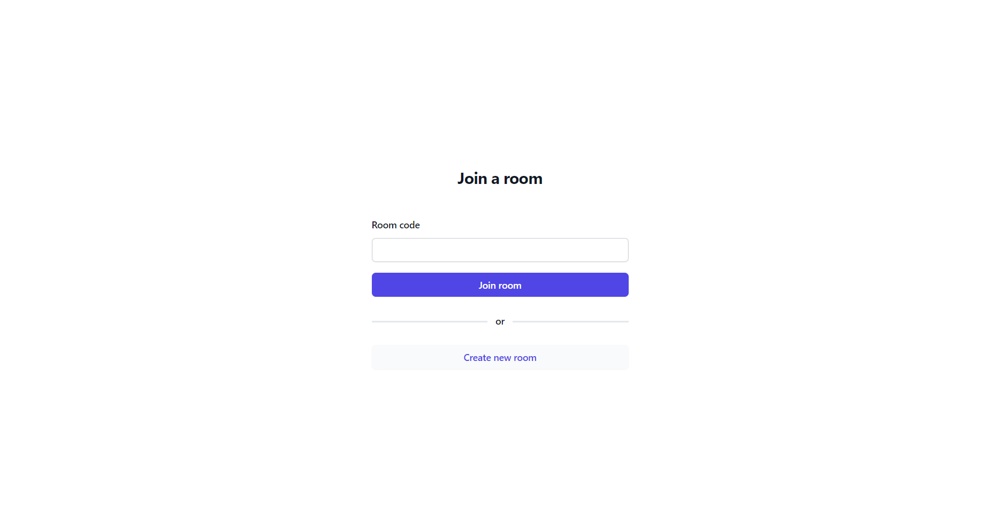
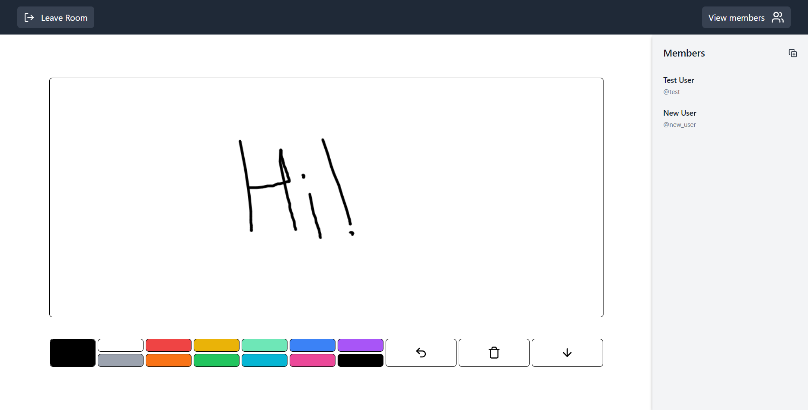
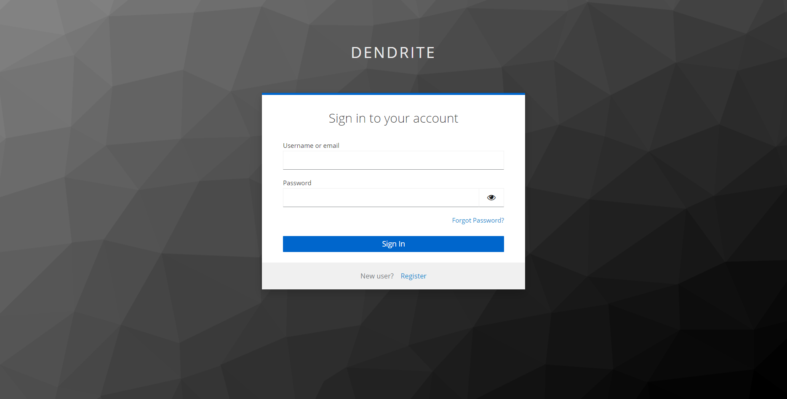

# Whiteboard Application

This is a collaborative whiteboard application where users can create or join sessions to draw together in real-time. The application provides various features for drawing, collaborating, and saving the whiteboard content.

## Features

- **Create or Join Sessions:** Users can create a new whiteboard session or join an existing one.
- **Drawing Tools:** The whiteboard supports drawing using different colors and brush sizes.
- **Undo:** Users can undo the last action on the whiteboard.
- **Real-Time Collaboration:** Users can see the cursors of other connected users moving in real-time, indicating their drawing actions.
- **Save as Image:** There's an option to save the whiteboard content as an image file.
- **Authentication:** Authentication (user signup and login) is implemented to ensure only authorized users can access the whiteboard.
- **Responsive Design:** The application is responsive and works on both desktop and mobile devices.

## Screenshots

### Join Room Page

### Whiteboard Page

### Login Page

## Technologies Used

- React.js
- Node.js
- Socket.IO
- Keycloak
- HTML5 Canvas API